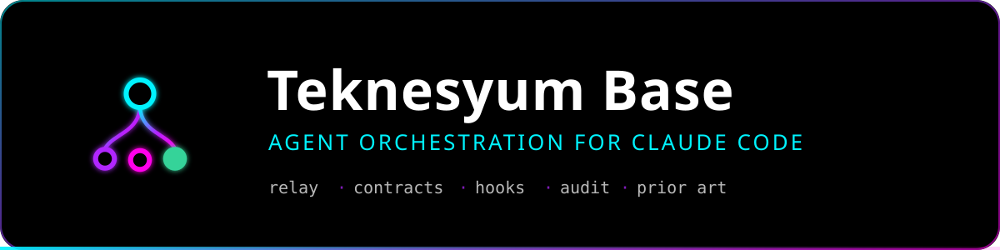
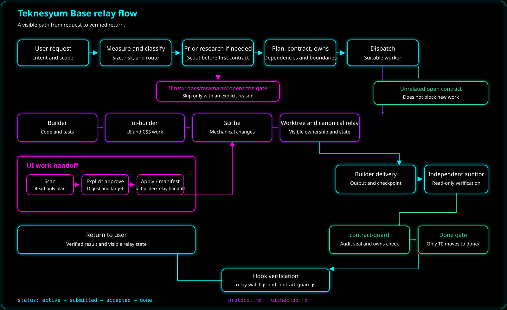

<div align="center">



**Say what you want. The system organizes the rest.**

A base layer for Claude Code: a multi-agent work relay, an independent auditor, and a
neon UI standard. How big a job is, how many pieces it splits into, which agent runs on
which model, and how the result is verified — the system decides, not you.

<a href="LICENSE"></a>
&nbsp;
<a href="https://github.com/sponsors/Teknesyum"></a>

</div>

---

## What it solves

Out of the box, Claude Code is a single assistant: you say what to do, it does it. Give it
a large job and the context fills up, it hits the limit, it forgets where it stopped; it
approves its own work; and it produces a differently-styled UI in every project.

| | Before | After |
|---|---|---|
| **Division of work** | One assistant does everything, context bloats | Split into contracts, handed to agents; intermediate output never reaches the main context |
| **Verification** | The author of the code declares it done | A separate auditor verifies it — it **cannot write or run anything** |
| **Interruption** | Hit the limit, start over | Every agent's trace is on disk; the next session picks the work back up on its own |
| **UI** | A different look every time | Same palette, same type scale, same signature |

### What this is not

An opinionated working protocol, not a security boundary. Two things here are mechanical —
hooks run as processes and cannot be talked out of it: the `done/` seal check and the
auditor's tool list. Everything else — sizing the work, splitting it into contracts,
assigning file ownership, choosing models — is the model following `SKILL.md`. That makes
it automatic, not deterministic. Treat it as a discipline that holds most of the time and
is auditable when it doesn't, not as a system that cannot be circumvented.

**There is no workflow to learn.** Five slash commands exist and all five are optional —
a project can be finished start to finish without typing any of them.

---

## Install

### Windows — one line

```powershell
irm https://raw.githubusercontent.com/Teknesyum/teknesyum-base/main/install.ps1 | iex
```

### macOS / Linux — one line

```bash
curl -fsSL https://raw.githubusercontent.com/Teknesyum/teknesyum-base/main/install.sh | bash
```

### From inside Claude Code

```
/plugin marketplace add Teknesyum/teknesyum-base
```
```
/plugin install teknesyum@teknesyum
```
```
/teknesyum:setup
```

**Restart Claude Code after installing.**

`/setup` inspects the machine, wires up everything that has one obvious answer, and asks
you only about the genuine choices — overwriting an existing statusline, installing a
global npm package, picking your output language. Skip it and the base notices at the next
session start and offers to run it.

**Required:** Claude Code. **Optional:** Node.js (statusline),
`typescript-language-server` (type intelligence), `graphify` (large-codebase indexing).
Whatever is missing is reported; none of it is mandatory.

> **Language.** Command names, agent roles and contract fields are English. What the base
> *writes back to you* — reports, explanations, agent output — follows the language you
> choose during setup, stored in `~/.claude/teknesyum.json`, defaulting to Turkish.
> Asking for `/report` does not mean you want an English report.

---

## How it works

When you ask for something, the `relay` skill engages and **classifies the request
silently**:

| Job size | What happens |
|---|---|
| A question, an explanation | It gets answered. Nothing is set up. |
| A one-line, eyeball-verifiable fix | Done directly — a contract would cost more than the fix |
| One capability, one agent-session of work | A single agent is spawned; the manager supervises |
| ≥3 independent pieces or ≥5 files | In-session relay: plan, contracts, parallel agents, audit |
| A project from scratch, or ≥3 capability areas | Task packets — see below |

The decision is announced in one line, so you can see which rule fired without being asked
to make the call yourself. Preparation happens without asking too: a missing git repo is
initialized with a safety commit before any file is touched, a project of thirty files or
more gets a dependency map built and queried instead of read, UI work is routed to an agent
with the theme standard preloaded, and missing `AGENTS.md` signposts get written when the
job closes.

<div align="center">

</div>

### Prior art comes before the first contract

A from-scratch project does not get designed from scratch. Before a single contract is
written, at least ten comparable repositories are split across parallel `scout` agents;
each writes one `docs/taramalar/<name>.md` under six fixed headings, and the manager merges
them into `docs/taramalar/RAPOR.md` as **adopted**, **deliberately rejected**, and
**suspicious**.

Nothing is copied. What gets taken is a pattern, a boundary, a mistake worth not repeating
— never source lines. Adopting a project whole is only ever a library decision, and that
one goes to you. Archived repositories stay in scope: *abandoned* is a warning against
depending on a project, not against reading it. Numbers that cannot be traced to a primary
source are tagged as unverified rather than repeated.

The gate is mechanical, not advisory: writing the first contract of a project that has
never completed any work and holds fewer than ten source files is blocked until the
research exists. Skipping is allowed — one line of reasoning in `docs/taramalar/ATLANDI.md`
opens the gate. Skipping silently is not.

### Product standards — three platforms, and staying up to date

Two defaults apply to the programs the relay produces, written down in
`skills/relay/references/standartlar.md`.

**A new project targets Windows, macOS and Linux.** Business logic calls no platform API,
paths are never built by hand, no shell is spawned to run a process, filenames are treated
as case-sensitive, and CI runs the test suite on all three. The portable part is the whole
program except its shell — which is what makes a later port a shell rewrite instead of a
rewrite.

Some programs are single-platform by nature: an overlay drawn over a Windows game, a
launcher built on shell file associations. Those turn the rule off in the project's own
`.claude/teknesyum.json`, with a reason — opting out is free, opting out silently is not:

```json
{ "platformlar": ["win"], "platformNeden": "built on Windows file associations" }
```

**On an existing project the rule never migrates anything on its own.** It asks once —
*this project is Windows-only, port it to three platforms?* — and a `no` is written down and
never asked again; a `yes` gets its own contract instead of being folded into whatever is
already running. The same shape as `/uicheckup`, which scans a project's UI against the
theme standard and writes nothing until you approve the plan.

The audit is deterministic, no model involved:

```bash
node teknesyum/scripts/platform-denetim.js <root> --kati
```

It reports embedded drive letters and home directories, shell invocations, Windows-only
target frameworks, filenames that collide when case is ignored, and the missing legs of a
CI matrix.

**Programs check for their own updates once a day, off the startup path.** Startup reads a
timestamp and nothing else; if the day has turned, the check runs after the window is up,
in the background, with a three-second timeout, and fails silently. The default is to
*tell* you a version exists — a silent background install is allowed only when a published
SHA-256 is verified first, because an updater is a code-execution channel. A program
installed through a package manager never updates itself. The prerequisite is a release
pipeline: every tag built for three platforms with checksums published, or no updater is
written at all.

### Contract layout

For large jobs every task is a file:

```
.claude/relay/
├── PLAN.md              task graph, dependencies
├── LOG.md               one-line event log
├── live/                agent traces — written by a hook, not by the model
└── contracts/
    ├── T3.md            open contracts
    └── done/            completed ones (write-protected)
```

Every contract declares what it owns (`owns`). **Two contracts are never given the same
file** — that is the discipline parallel work rests on. Be precise about what backs it:
ownership is assigned by the manager when contracts are written and checked against
`git status` when they close. No hook rejects a stray write to a file outside a contract's
`owns` set. If you want a hard wall instead of a rule, set `worktree_isolation : on` and
each agent works in its own git worktree, where the file system does the enforcing.

### The completion gate

A contract moves `open → active → submitted → done`. The agent can reach `submitted` and
no further: **it cannot mark its own work complete or move its contract into `done/`.**
That transition belongs to the manager alone, after the auditor returns a pass, and it
requires a seal in the contract's frontmatter:

```yaml
audit: passed
auditor_id: <the auditing agent>
diff: <the range the auditor was shown>
verification: npm test → exit 0
```

A hook enforces the gate instead of trusting it, and it checks all four fields — a bare
`audit: passed` with the rest left at `—` is refused. An unsealed file cannot land in `done/`
through `Write`, and cannot get there through the shell either — redirects, `mv`,
`Move-Item`, `cp` and deletions targeting `done/` are refused unless the source already
carries the seal. Reading is untouched. Without this, an agent that finished badly could
declare itself done and quietly drop out of the audit queue.

### Surviving interruptions

When an agent starts and when it ends is written to `live/` **by a hook** — it does not
depend on the model cooperating:

```json
{
  "contract": "T3", "agent_type": "builder",
  "stop_reason": "max_tokens",
  "last_word": "Theme tokens written, panel integration still pending."
}
```

Any `stop_reason` other than `end_turn` means the agent died. It is revived with its own
context first; if that fails, a handover brief for a fresh agent is built from the trace.
**This happens on its own.** Open a session in a project with contracts still in flight and
the base reads the traces and continues — no resume command exists, because none is needed.

Two limits, both measured rather than assumed. A subagent's own tool calls usually do not
reach the hook layer — they did in one worktree-isolated run and in none of the others — so
there is no dependable per-agent progress counter, and the statusline shows who is running
and for how long rather than inventing a percentage. When two agents of the same role are
open it says the elapsed time is ambiguous instead of guessing which one just finished.
And when a session is opened somewhere without a relay directory, traces go to a
per-session folder under `~/.claude/teknesyum/live/`, so tracking works with zero setup.

### Fix loop

When the auditor rejects: rounds 1–3 continue with the **same agent**, preserving context;
rounds 4–5 assign a fresh agent on a stronger model; at the ceiling the decision comes to
you. Nothing moves forward while a critical finding is open.

### Task packets — moving work out of the session

**The manager plans; it does not do the work.** It writes nothing outside `.claude/relay/`.
Everything else is executed by an agent it spawns, or by a *task packet* run outside the
session entirely.

Subagents share one context ceiling and all die when the session closes, so large work is
split into three to five packets, each owning a **non-overlapping set of files**. The split
is deliberate: the packet file is long and exact — numbered steps, writable paths,
untouchable files, measurable acceptance criteria — while what you paste is one line:

```
.claude/relay/G2.md oku ve içindeki görevi eksiksiz uygula.
```

Packet files carry no tool-specific syntax, so **a packet can be handed to a different tool
entirely**: another Claude Code session, Codex, a GPT-based agent. When one comes back you
just say so; the manager reads the packet reports and `git status` itself, flags writes
outside the declared area, runs the auditor, carries the produced signatures into dependent
packets, and prints the next wave of prompts.

The return trip obeys the same rule, and this is the half that is usually missing. A worker
that finishes does not narrate its work into the chat; it writes the report to a file and
hands back at most five lines — what closed, where the report is, and one open question if
there is one:

```
T3 teslim edildi · 747 test yeşil, build temiz
Rapor: docs/tasks/T19-isolated-performance-e2e.md
Açık: main'e commit yetkisi bende mi?
```

Both directions are enforced by the `Stop` hook, and in both directions: a packet or report
body dumped into the chat is refused, and so is announcing completion while a contract is
open without handing back the block. A ceiling without a floor just produces workers that
finish silently.

---

## Components

### Agents

| Agent | Job | Default model |
|---|---|---|
| `builder` | Code — modules, algorithms, endpoints, refactors, tests | sonnet |
| `ui-builder` | UI; the theme standard is preloaded into its context | sonnet |
| `auditor` | Verifies acceptance criteria — **cannot write or run anything** | sonnet |
| `scribe` | Mechanical bulk work — naming, formatting, documentation | haiku |
| `scout` | Prior-art research — scans comparable repos, writes no code | sonnet |

Role determines the kind of work, model the weight; they are separate axes, and the model
is chosen at call time.

The auditor's restriction is enforced by the harness rather than by its prompt: it holds
`Read`, `Grep`, `Glob` and `LSP` — no `Write`, no `Edit`, and **no `Bash`**, because a
shell is a write tool. Evidence that needs a command (tests, build, `git diff --name-only`)
is run by the manager and pasted into the audit request; anything not supplied comes back
marked unproven rather than silently passing. A test asserts the tool list, so the
guarantee cannot quietly erode.

### Commands

| Command | When |
|---|---|
| `/report` | "Where are we?" Contract progress, running agents, what is left |
| `/rule` | "Don't do that again." Records a permanent rule in the right layer |
| `/setup` | Wires this machine up. Once, at install time |
| `/uisetup` | Configures or disables the UI standard |
| `/uicheckup` | Scans UI files and prepares an approved relay manifest |
| `/save` | Writes this session to disk — transcript, context, git state, unsent text |
| `/load` | Reads a saved session back and picks up where it stopped |
| `/help` | What the base does and when, on one screen |

There is no command to set a relay up and none to resume interrupted work — both happen on
their own.

### Session save and load

Relay resumes work on its own, but what it resumes are *contracts* — the plan, not the
conversation. `/save` covers the other half. It writes the session to
`<project>/.claude/oturumlar/<name>/` as four files: `ham.jsonl`, a byte-for-byte copy of
the transcript, so nothing is lost; `ozet.md`, the digest `/load` reads back, with every
turn, each tool call as name plus target, the last ten turns kept long and older ones
trimmed; `durum.json`, holding the session id, model, context usage, git HEAD and dirty
files, open relay contracts, the message queue and the unsent text; and `calisma.diff`, a
patch of the dirty working tree at save time, untracked files included.

The unsent text is what sits in the input box, typed but never submitted. Claude Code keeps
only a 200-character preview of it, so that is what the record holds. Messages queued while
Claude was working are stored in full.

`/load` with no argument takes the newest record and compares it against the repo as it
stands now: a moved `git HEAD`, a different project root, or a stored patch each come back
as a warning line. The patch is never applied on its own — `/load` reports it, you decide.
Records are local and stay out of git.

```
/save                 name the record after the date
/save relay-refactor  name it yourself
/load                 newest record
/load relay-refactor  a specific one
```

### UI checkup

`/uicheckup` uses a deliberate two-stage flow. The first stage scans the target project without
writing to it and emits a deterministic JSON plan containing the UI files, findings, file digests
and plan digest. Review and save that plan before the second stage.

```powershell
node "<plugin>/scripts/uicheckup.js" "<target>" > ui-plan.json
```

The second stage requires explicit approval, the plan digest and the same target root. It rechecks
the plan and every file, rejects stale plans and path traversal, and emits a write-free manifest.
That manifest is handed to `ui-builder/relay`; the apply CLI never silently patches target files.

```powershell
node "<plugin>/scripts/uicheckup-apply.js" --approve --plan ui-plan.json --plan-digest <digest> --target "<target>"
```

The same Node commands and semantics work on Windows PowerShell, macOS and Linux shells. Shell
redirection is shown only for saving the scan output; the checkup itself uses no platform-specific
path assumptions.

### Statusline

Multiple lines showing context usage, **your plan limits** (5-hour and weekly), contract
progress, and the agents running right now with their elapsed time. Dead agents are
labelled in plain language. It is rendered for you and never for the model, so its
**token cost is zero**.

`settings.json` points at a small bridge in your config directory rather than at the plugin
itself. The plugin cache is versioned, so a direct path breaks on the next update and a
hand-made copy freezes at whatever version you copied; the bridge resolves the newest
installed version at render time and stays correct across updates.

### Hooks

- `contract-guard.js` — enforces the completion gate on `Write`, `Edit` and `Bash`; keeps
  the contract status ladder one-way (`open → active → submitted → done`, with `blocked`
  reachable from anywhere), so a correction round cannot reset the audit queue; and holds
  the prior-art gate shut on a brand-new project
- `relay-watch.js` — eleven events. It writes agent traces (`SubagentStart` / `PostToolUse` /
  `SubagentStop`) including the model and effort the agent *actually* ran at, narrates what
  the base is doing (`SessionStart` / dispatch / agent finish), requires a sizing verdict on
  every request (`UserPromptSubmit`), enforces the handoff rule in both directions (`Stop`),
  parses every `.js`/`.json` the moment it is written and hands the syntax error straight
  back (`PostToolUse`), feeds open contracts and the route position back into a freshly
  compacted context (`PostCompact`), seals unfinished agent records at shutdown
  (`SessionEnd`), records rate-limit and overload interruptions (`StopFailure`), and records
  a failing tool without counting it as progress (`PostToolUseFailure`)

### Visible steering

You cannot see inside the agents, so the base narrates itself. One line per real event,
emitted by a hook rather than promised by a model:

```
Teknesyum ▸ röle kurulu · sözleşme 4/7 bitti · 3 açık · kaldığım yerden sürdürüyorum
Teknesyum ▸ görev veriliyor · builder · sonnet · tab component
Teknesyum ▸ bitti · builder · 4 dk
```

Every work request also gets a sizing verdict — including the requests that need no agent
at all, so silence never means "is this thing even loaded?":

```
`Teknesyum ▸ size · one file, verifiable by eye — no agent needed, I did it myself`
`Teknesyum ▸ size · new project, three skill areas — split into 8 contracts as task packets`
```

The sizing and difference lines are printed as code spans, so they read as a block instead
of disappearing into the prose around them.

**How much of this you see is a setting** — `steering` in `~/.claude/teknesyum.json`,
asked once by `/setup`:

| Level | What you see |
|---|---|
| `0` | Nothing. No `Teknesyum ▸` line is ever printed. |
| `1` | Session start, dispatch, agent finish, sizing verdict. **Default.** |
| `2` | All of the above plus a line wherever the base changed the outcome. |

Level 2 exists because the interesting part is invisible: work split across agents that a
plain session would have run sequentially, a deterministic tool chosen over a model call,
an auditor sending a contract back, a hook refusing a write.

```
`Teknesyum ▸ diff · split the job into 4 contracts across 2 agents — one session would have run them in a row`
`Teknesyum ▸ diff · mapped the imports with harita.js — one disk scan instead of reading 30 files`
`Teknesyum ▸ diff · the auditor sent T2 back — acceptance criterion 3 was not met`
```

A difference line is a trace record, not a boast — if you cannot say what a plain session
would have done instead, the line is not written. `TEKNESYUM_SESSIZ=1` still equals level
`0`; `TEKNESYUM_STEERING=0|1|2` overrides for a single session.

### Tests

```bash
node test/run.js
```

102 checks driving the real hooks and the real statusline with real payloads: the
announcements, the trace files, the completion gate (including shell bypasses and relative
Windows paths), concurrent hook processes writing the same file, and the packaging
invariants — no `hooks` key in the manifest, a valid `.lsp.json`, the auditor's tool list,
no pinned version in the statusline bridge, no stale command name anywhere in the tree.
Plain Node, no dependencies; CI runs it on every push.

### Code intelligence

Before opening files, agents ask what is connected to what:

```bash
node "${CLAUDE_PLUGIN_ROOT}/scripts/harita.js" .
```

`harita.js` reads `import` / `require` / `using` lines straight from source and writes
`.claude/harita.md` plus `harita.json`: hubs, cycles, orphans, file-to-file edges. **No
model call and no parser to install** — a 123-file project takes seconds and produces
about 9 kB. C# `using` resolves to a namespace node rather than a single file, because
binding a namespace to one file produced convincing but fake edges. The rule is thirty
source files, or a job touching three or more modules; below that `Grep` is cheaper.

This is not a replacement for a semantic graph — it answers *what breaks if I touch this*,
not *what does this mean*. Understanding a foreign codebase is still a job for something
that reads it.

The plugin ships an `.lsp.json` registering `typescript-language-server` for
`.ts .tsx .mts .cts .js .jsx .mjs .cjs`. Agents then resolve definitions and references
through the language server instead of grepping, and see compile errors without a build.

```bash
npm i -g typescript-language-server typescript@5
```

Two things worth knowing, both learned the hard way:

- **Pin TypeScript to 5.x.** The 7.x line is the native port and ships no `lib/tsserver.js`,
  so the server dies during `initialize` — and Claude Code silently continues without LSP,
  with no warning anywhere.
- **The server starts lazily**, on the first `LSP` tool call rather than at session start.
  Checking the process list proves nothing; the tool being present does.

If `typescript-lsp@claude-plugins-official` is also enabled, both declare the same
extensions, the second is ignored and a warning is printed. Disable one.

---

## UI standard

Default palette — a neon triad on a dark ground:

| | Hex | Used for |
|---|---|---|
| Primary | `#00f3ff` | Actions, active state, numeric emphasis, headings |
| Secondary | `#ff00ea` | Warnings, destructive actions, critical values |
| Tertiary | `#b026ff` | Mode switches, scrollbars, secondary buttons |
| Success | `#34d399` | "Completed", and nothing else |
| Ground | `#000000` | The window itself — true black |
| Text | `#ffffff` | Anything meant to be read |

Contrast is not negotiable: mid greys (`#d1d5db`, `#9ca3af`, `#6b7280`) are not in this
palette. Hierarchy comes from size, weight, tracking and neon color — never from dimming
text toward the background. The floor is 7:1.

Typography: **Segoe UI** for text, **Consolas** for every number, key, code fragment and
duration. Scale 10 → 13 → 14 → 18 → 24, nothing in between.

The rules forbid inventing colors and dimensions: radius is one of four values, spacing one
of five, neon text is never left without a glow, numbers are never set in a sans font, and
nothing may cover a neighbour's outline or clip its glow.

Supported stacks: Tailwind v4, plain CSS, React, Electron, WPF (XAML), WinForms, ANSI
console. **The theme covers the whole application** — a checklist walks the places a native
grey box usually survives: scrollbars, message boxes, combo box popups, checkboxes,
tooltips, context menus, tab headers, focus rings, disabled states. Desktop UI carries
extra hard rules on top: nothing may be clipped, no button strip may drop an element, the
system title bar is replaced by a themed strip.

### Project layout

The base also has an opinion about where things live, because a root directory full of
loose notes is the first thing that makes a project unreadable:

```
src/  docs/  locale/  settings/  tools/  tests/  .claude/  README.md  <the executable>
```

`docs/` holds every document a human reads — plan, roadmap, decision log, task packets,
prior-art scans, notes agents leave each other. Folder signposts are `AGENTS.md`, so every
tool reads the same file; a one-line `CLAUDE.md` holding `@AGENTS.md` sits next to it, since
Claude Code's own discovery of `AGENTS.md` could not be verified. `.claude/relay/` holds live contract state, because a hook
guards that path. UI strings never live in code: `locale/tr.json` is the source, adding a
language is copying one file, and a translator never opens a source file.

### Customization

```
/uisetup                      show current settings
/uisetup kapat                disable the UI standard entirely
/uisetup palet #ff6b00        change the primary color
/uisetup font Inter           change the default font
/uisetup imza kapat           remove the signature block
/uisetup not <text>           write your own rule — yours wins on conflict
/uisetup sifirla              restore defaults
```

Settings live in `~/.claude/teknesyum-ui.json`; only the fields you change are written.
For per-project settings create `.claude/teknesyum-ui.json` in that project — it overrides
the user-level file. With `kapat`, no color or dimension is imposed at all and the
project's own style is followed.

A small right-aligned signature is added to the settings/about section of generated UIs: a
GitHub link and a support link, the support button outlined rather than filled. Remove it
with `/uisetup imza kapat`, or point it at your own account with `/uisetup imza github <url>`.

---

## Settings

Behavior knobs live in `skills/relay/SETTINGS.md`:

| Knob | Default | What it controls |
|---|---|---|
| `ask_threshold` | `critical` | When an agent stops to ask you something |
| `approval_gate` | `none` | Whether the plan is submitted for approval |
| `audit` | `every-contract` | When the auditor runs |
| `fix_ceiling` | `5` | After how many rounds the decision comes to you |
| `model_escalation` | `on` | Whether round 4 escalates to a stronger model |
| `parallel_width` | `2` | Cap on concurrent agents |
| `worktree_isolation` | `off` | Whether agents work in an isolated repo copy |
| `report_length` | `short` | How much an agent reports back to the manager |
| `briefing` | `milestone` | How often the manager reports to you |

Per-project override: `<project>/.claude/relay/SETTINGS.md`.

Three settings are per-machine rather than per-project, and `/setup` asks for all of
them: `dil` (`en` default, or `tr`) in `~/.claude/teknesyum.json` — it governs both the
notifications you see and the language agents write to each other in; `steering` (`0` | `1` | `2`, see [Visible steering](#visible-steering)) in
`~/.claude/teknesyum.json`, and the UI standard in `~/.claude/teknesyum-ui.json` — keep the
defaults, customize the palette, typography and signature, or switch it off entirely with
`"kapali": true` so no color or measurement is imposed.

---

## Cost

Claude Code's own measurement:

```
Skills (8) · Agents (4) · Hooks (5)
Always-on:  ~1,211 tokens     added to each session
```

Well under one percent of a 200k context, paid once per session — later messages hit the
prompt cache at roughly a tenth of that. Skill bodies load only when triggered; the full
relay protocol is read only when a relay is actually set up.

One rule shaped the whole design: **delegate when the ratio of intermediate output to
returned summary is high.** Exploration and scanning die inside the subagent's context;
only the conclusion comes back.

---

## Measured on a real run

End to end on a React project: **8 contracts, 16 agents.**

The auditors caught **4 real defects**, none of which build or lint could have caught:

- An `@import` in the wrong place, silently dropping fonts — the agent had called it a
  "harmless warning"
- A keyboard shortcut that was never implemented, while the agent's output said "done"
- Raw hex colors used twice where a token existed

Two of those were cases where **the agent's report contradicted the code.** Without the
auditor, both would have shipped.

The session limit killed three agents at once; all three were revived with their own
context and no handover was needed. All eight contracts closed, with no ownership violation
and no change to the dependency files.

---

## Updating

```
/plugin marketplace update teknesyum
```
```
/plugin update teknesyum@teknesyum
```

Restart Claude Code afterwards. Your settings in `~/.claude/teknesyum-ui.json` are
preserved across updates.

**Upgrading from 1.x:** agent roles, contract fields, settings keys and the trace folder
were renamed to English in 2.0.0. Projects with open contracts need the frontmatter field
names updated by hand (`rol → role`, `tur → round`, `denetim → audit`,
`dogrulama → verification`, `yan_etki → side_effects`). The old `canli/` trace folder keeps
working — a project that already has one is still written to, so no trace is lost.

---

## Support

<div align="center" role="region" aria-label="Support Teknesyum" style="border:2px solid #00f3ff;border-radius:24px;background:#000000;padding:24px">

<a href="https://github.com/sponsors/Teknesyum"></a>

<a href="https://github.com/sponsors/Teknesyum"></a>
&nbsp;
<a href="LICENSE"></a>

</div>
