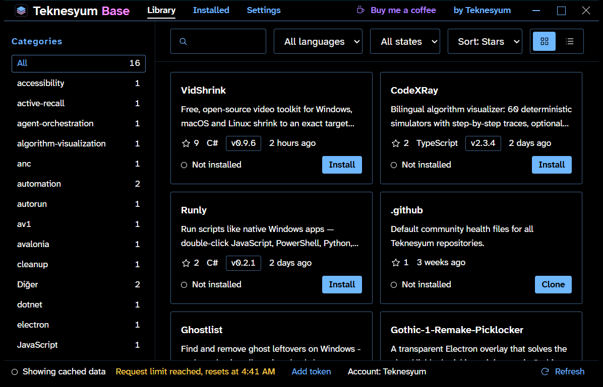
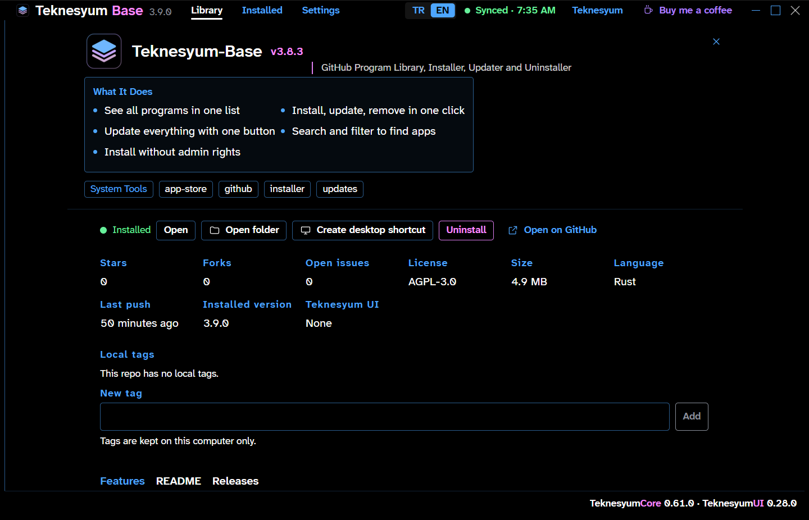
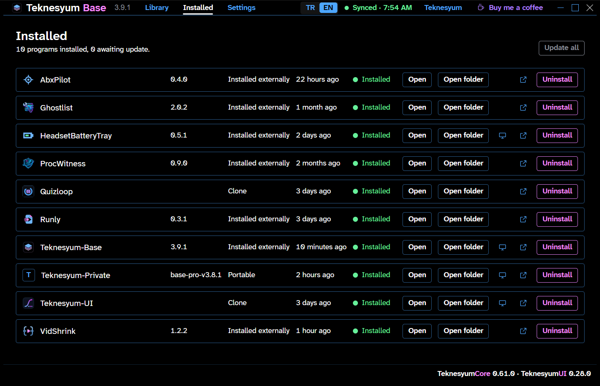
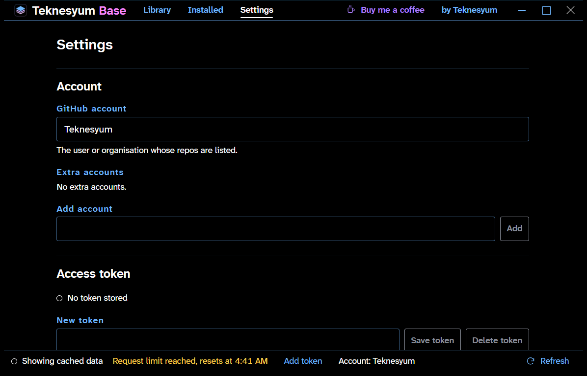

<!-- lang -->

[](README.tr.md)


# Teknesyum Base

Browse, install, update.

## Numbers

Measured against the Teknesyum account on 2026-09-27.

| What | Count |
|---|---|
| Repositories listed | 16 |
| With a published release | 12 |
| With a Windows asset in that release | 9 |
| With a `teknesyum.json` manifest | 0 |
| Backend tests passing | 14 of 14 (3 network tests skipped by default) |

## What it is

Teknesyum Base is a single Windows program that lists every public repository of a GitHub account. It shows stars, the latest release, the licence and the README of each one. When a release carries a Windows build, Base downloads it, checks it and installs it for the current user. It also updates and removes what it installed. The default account is Teknesyum; any other account can be set in Settings.

## Doesn't GitHub already do this?

GitHub shows the repositories and lets you download a release by hand. That part is not new. Base adds:

- **One list with install state.** Each repository shows whether it is installed, which version, and whether a newer release exists.
- **Install without admin rights.** Zip and portable builds go under `%LOCALAPPDATA%`, with a Start menu shortcut. No UAC prompt.
- **Grouping.** Repositories are grouped by the category in their manifest, by language or by your own local tags.
- **Clone.** With git present, a repository can be cloned to a folder of your choice.

## Features

- **Library** — cards or a dense list, filtered by search, category, language, tag and state.
- **Detail sheet** — README, release history with notes, assets with size and download count.
- **Install dialog** — watch resolve, download, verify, install and shortcut steps; cancel at any time.
- **Freshness dot** — on each card. Green when the icon matches the app's own .ico and the screenshot and README have changed since the previous release (the icon falls back to that date rule when the repo has no .ico); a warning ring otherwise, with the stale items in its tooltip.
- **Installed** — launch, open the folder, update or remove.
- **Clone install** — a repository without a release is cloned instead.
- **Live icons and screenshots** — read from each repository's `.teknesyum/` folder and cached; a click opens the full-resolution image.
- **Desktop shortcut and GitHub page** — one click each, from the card, the detail sheet or the Installed tab.
- **Plugin versions** — the latest Teknesyum Core and Teknesyum UI versions sit in the status bar.
- **Your own account** — point Base at any GitHub user or organisation, plus extra accounts.
- **Offline cache** — the last list is kept and shown when the network is down, with its age.
- **Self-update** — Base checks 10 seconds after every start, then hourly. An update is downloaded silently and applied on the next launch. The version sits muted in the title bar; click it to check now — it opens the update panel, or says you are up to date.
- **Two builds** — the normal build lists public repositories. The Pro build also lists private ones.
- **Repository key** — paste a read-only key for one private repository into Settings, and the normal build lists and installs that repository too. The key is checked on GitHub and stored in Windows Credential Manager.
- **Remove from the card** — an installed program offers Remove on its card; removal fills the same bar file by file and only deletes the desktop shortcut that points into the program's folder.
- **Preview releases** — when a repository has only pre-releases, Base installs and updates from the newest one.
- **Startup refresh bar** — while the list refreshes, a bar under the title bar fills repository by repository.

## What it doesn't do

- It does not install programs that need admin rights silently. An `msi` or setup `exe` opens its own window.
- It cannot remove programs installed by a setup `exe`; use Windows Settings for those.
- It never writes to GitHub. Every request is a read.
- It does not run on macOS or Linux.
- It is not signed yet. Windows SmartScreen may warn on first launch.

## Install

Download `Teknesyum.Base_<version>_x64-setup.exe` from [Releases](https://github.com/Teknesyum/Teknesyum-Base/releases) and run it. It installs for the current user; no admin rights are asked. The SHA-256 of each installer is in the release notes.

WebView2 is required; Windows 10 and 11 normally have it, and the installer fetches it when missing.

## How it works

Base calls the GitHub REST API for the account's repositories, then for each one its latest ten releases and its `teknesyum.json`, if any. Without a token GitHub allows 60 requests an hour; the first refresh of 16 repositories costs about 17. After that Base sends the stored ETag, reuses the releases and manifest of a repository whose last push has not changed, for up to six hours, and a second refresh costs 1. When the limit is reached it keeps showing the cached list with the time the limit resets. In the normal build a personal token raises the limit to 5,000 and is kept in Windows Credential Manager, never in a file.

To install, Base picks the asset named in the manifest, or the first Windows asset by extension. It downloads to a temporary file, checks the SHA-256 when the release publishes one, extracts or runs it, and records what it placed. Updating replaces that record; removing deletes only what was recorded.

A repository can describe itself with a `.teknesyum/` folder: `teknesyum.json` (the manifest), `icon.png`, `shot.jpg` (screenshot) and `full.jpg` (full-resolution image). Base reads it live from each repository. A catalog index, built hourly by GitHub Actions, is used as a fallback. Example `teknesyum.json`:

```json
{
  "name": "VidShrink",
  "category": "Media",
  "asset": "VidShrink-*-win-x64.zip",
  "method": "zip",
  "run": "VidShrink.exe"
}
```

## The program shows what it is doing

| Screen | What it shows |
|---|---|
|  | The library: every repository with stars, latest release, install state and freshness dot. |
|  | One repository: README, releases, assets. |
|  | Installed: launch, open the folder, update, remove. |
|  | Account, folders, token and language. |

## Development

```bash
npm install
```

```bash
npm run tauri dev
```

```bash
npm run tauri build
```

Frontend: React 19, TypeScript and Vite in `src/`. Backend: Rust and Tauri 2 in `src-tauri/`. The contract between them is `src/api/types.ts`. Without Tauri, `npm run dev` serves the interface with mock data on port 1430.

Backend tests run with `cargo test` in `src-tauri/`. Set `TEKNESYUM_BASE_ROOT` to a temporary folder to keep tests out of your real install folders.

`scripts/kare.ps1` captures the screenshots from the built exe (`--kare=<view>@<lang>`). `scripts/release.ps1` refuses to publish when `.teknesyum/shot.jpg`, `.teknesyum/full.jpg` or README.md were not updated since the last release tag.

The Pro build (`--features pro --config src-tauri/tauri.pro.conf.json`) also lists private repositories with a read-only token. The keys are embedded in the exe; nothing is written to Credential Manager. A per-repository key is lent to a launched program for that session only. It is for the author's own machines and is not published here.

Design tokens and the window shell come from Teknesyum UI; values live in `teknesyum-ui/theme.tokens.json`.

## Contributing

Open an issue before a large change. Keep pull requests small and focused. Code, commits and issues are in English. Contributions are accepted under the project's licence; there is no CLA.

If Base is useful to you, you can sponsor the work below.

## Licence

[AGPL-3.0-or-later](LICENSE)

<!-- signature -->
<div align="center">

<a href="https://github.com/sponsors/Teknesyum"></a>
&nbsp;
<a href="LICENSE"></a>

</div>
