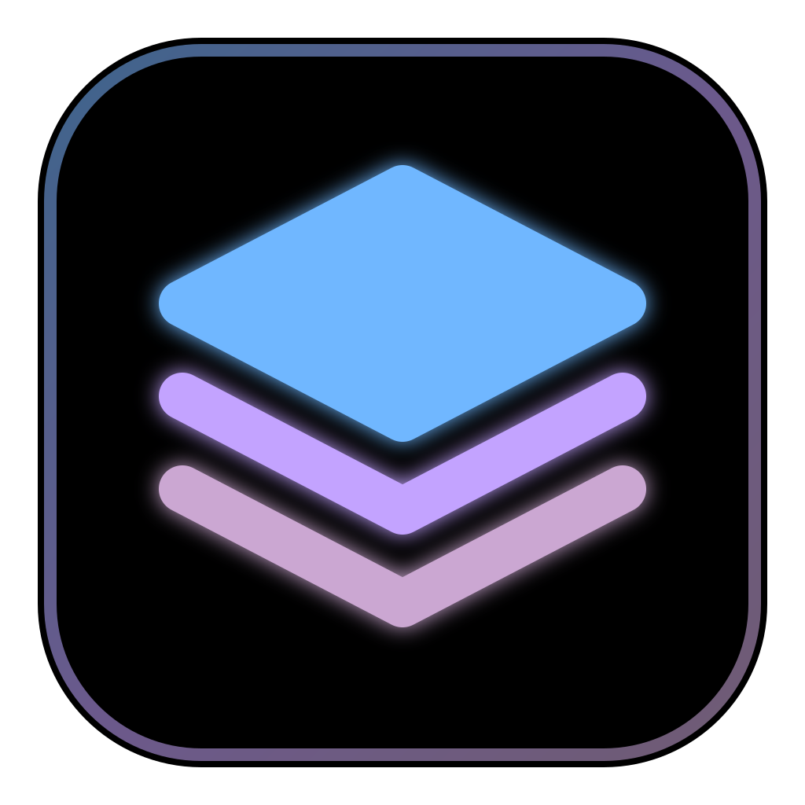
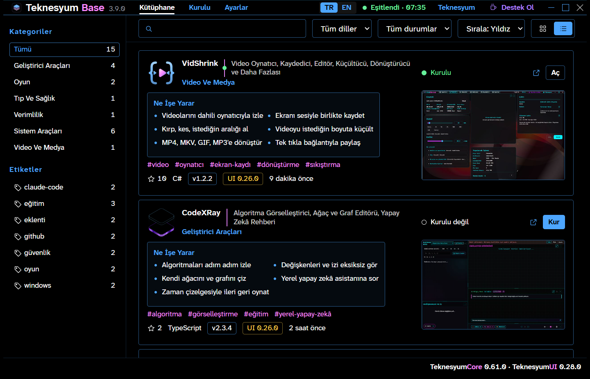
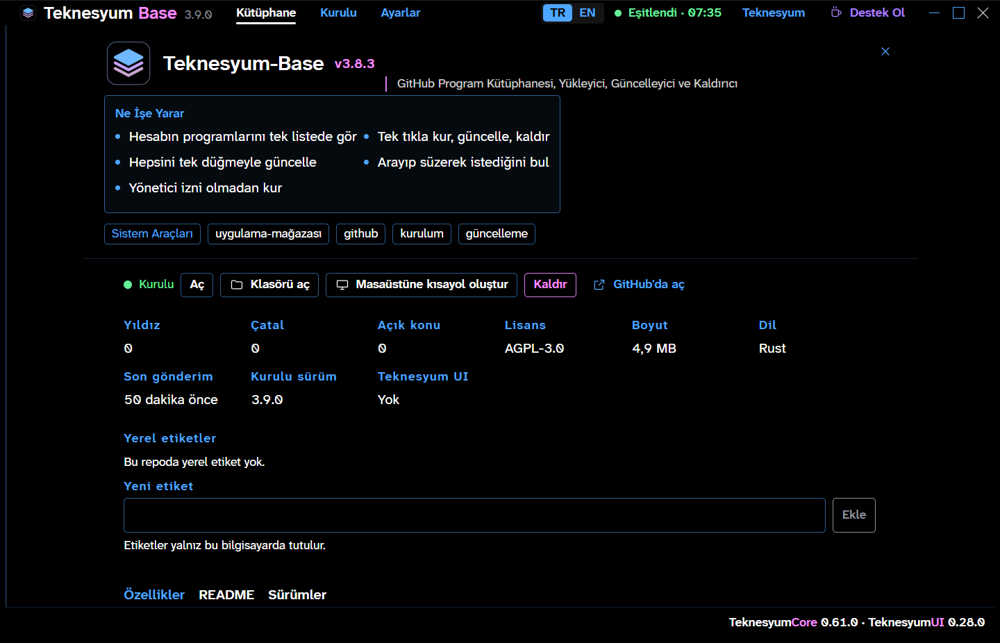
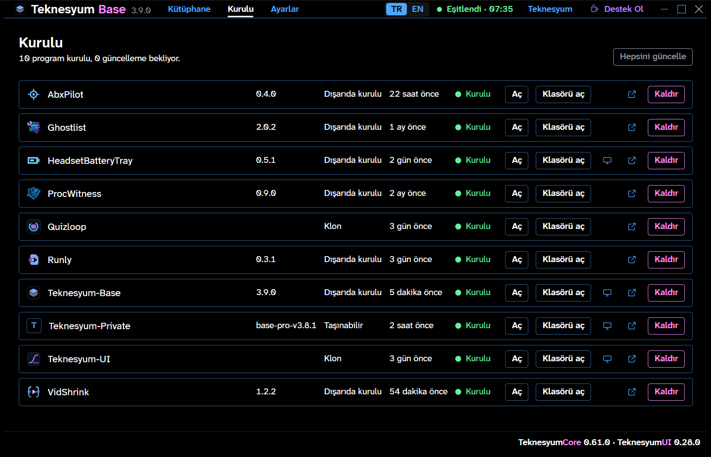
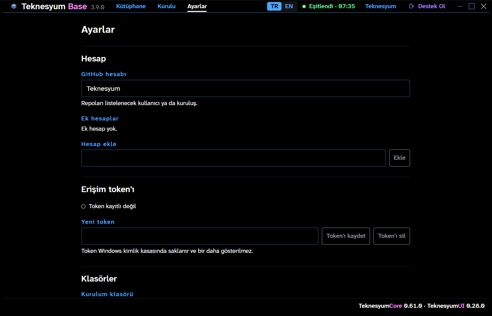

<!-- lang -->

[](README.md)



# Teknesyum Base

İncele, kur, güncelle.

## Sayılar

27.09.2026'da Teknesyum hesabına karşı ölçüldü.

| Ne | Sayı |
|---|---|
| Listelenen depo | 16 |
| Yayımlanmış sürümü olan | 12 |
| O sürümde Windows dosyası olan | 9 |
| `teknesyum.json` manifesti olan | 0 |
| Geçen arka uç testi | 14 / 14 (3 ağ testi varsayılan olarak atlanır) |

## Nedir

Teknesyum Base, bir GitHub hesabının bütün açık depolarını listeleyen tek bir Windows programıdır. Her deponun yıldızını, son sürümünü, lisansını ve README'sini gösterir. Sürümde Windows derlemesi varsa Base onu indirir, denetler ve geçerli kullanıcı için kurar. Kurduğunu günceller ve kaldırır. Varsayılan hesap Teknesyum'dur; başka bir hesap Ayarlar'dan seçilir.

## GitHub bunu zaten yapmıyor mu?

GitHub depoları gösterir ve bir sürümü elle indirmenize izin verir. O kısım yeni değil. Base şunları ekler:

- **Kurulum durumuyla tek liste.** Her depo kurulu mu, hangi sürüm, daha yeni sürüm var mı, gösterir.
- **Yönetici izni olmadan kurulum.** Zip ve taşınabilir derlemeler `%LOCALAPPDATA%` altına, Başlat menüsü kısayoluyla gider. UAC sorusu çıkmaz.
- **Gruplama.** Depolar manifestteki kategoriye, dile ya da kendi yerel etiketlerinize göre gruplanır.
- **Klonlama.** git varsa depo seçtiğiniz bir klasöre klonlanır.

## Özellikler

- **Kütüphane** — kartlar ya da sık liste; arama, kategori, dil, etiket ve duruma göre süzülür.
- **Detay paneli** — README, notlarıyla sürüm geçmişi, boyut ve indirme sayısıyla dosyalar.
- **Kur diyaloğu** — çözümleme, indirme, denetim, kurulum ve kısayol adımlarını izle; istediğin an iptal et.
- **Tazelik noktası** — her kartta. Simge, ekran görüntüsü ve README son sürüme göre güncelse yeşil; değilse uyarı halkası.
- **Kurulu** — başlat, klasörü aç, güncelle ya da kaldır.
- **Klon kurulumu** — sürümü olmayan depo klonlanır.
- **Canlı simge ve ekran görüntüleri** — her deponun `.teknesyum/` klasöründen okunur ve önbelleğe alınır; tıklayınca tam çözünürlüklü görsel açılır.
- **Masaüstü kısayolu ve GitHub sayfası** — karttan, ayrıntı panelinden ya da Kurulu sekmesinden tek tıkla.
- **Eklenti sürümleri** — Teknesyum Core ve Teknesyum UI'ın son sürümleri durum çubuğunda.
- **Kendi hesabın** — Base'i herhangi bir GitHub kullanıcısına ya da kuruluşuna, ek hesaplarla birlikte yönelt.
- **Çevrimdışı önbellek** — son liste saklanır; ağ yokken yaşıyla birlikte gösterilir.
- **Kendini güncelleme** — Base her açılıştan 10 saniye sonra, sonra saatte bir denetler. Güncelleme sessizce indirilir ve sonraki açılışta uygulanır. Sürüm başlık çubuğunda soluk görünür.
- **İki derleme** — normal derleme açık depoları listeler. Pro derleme özel depoları da listeler.

## Yapmadıkları

- Yönetici izni isteyen programları sessizce kurmaz. `msi` ya da kurulum `exe`'si kendi penceresini açar.
- Kurulum `exe`'siyle kurulan programları kaldıramaz; onlar için Windows Ayarları kullanılır.
- GitHub'a hiçbir şey yazmaz. Her istek okumadır.
- macOS ya da Linux'ta çalışmaz.
- Henüz imzalı değildir. Windows SmartScreen ilk açılışta uyarabilir.

## Kurulum

[Releases](https://github.com/Teknesyum/Teknesyum-Base/releases) sayfasından `Teknesyum.Base_<sürüm>_x64-setup.exe` dosyasını indirip çalıştırın. Geçerli kullanıcı için kurar; yönetici izni istenmez. Her kurulum dosyasının SHA-256'sı sürüm notundadır.

WebView2 gerekir; Windows 10 ve 11'de genelde vardır, yoksa kurulum dosyası indirir.

## Nasıl çalışır

Base, GitHub REST API'den hesabın depolarını, sonra her biri için son on sürümünü ve varsa `teknesyum.json` dosyasını ister. Token olmadan GitHub saatte 60 isteğe izin verir; 16 depoluk ilk yenileme yaklaşık 17 istek harcar. Sonrasında Base saklanan ETag değerini gönderir, son gönderimi değişmeyen bir deponun sürüm ve manifest bilgisini altı saate kadar yeniden kullanır; ikinci yenileme 1 istek tutar. Sınır dolduğunda önbellekteki listeyi, sınırın sıfırlanacağı saatle birlikte göstermeye devam eder. Normal derlemede kişisel bir token sınırı 5.000'e çıkarır ve dosyada değil Windows Kimlik Bilgileri Yöneticisi'nde saklanır.

Kurmak için Base manifestte adı geçen dosyayı, yoksa uzantısına göre ilk Windows dosyasını seçer. Geçici bir dosyaya indirir, sürüm bir sağlama dosyası yayımlıyorsa SHA-256'yı denetler, açar ya da çalıştırır ve yerleştirdiğini kaydeder. Güncelleme bu kaydı değiştirir; kaldırma yalnız kaydedileni siler.

Bir depo `.teknesyum/` klasörüyle kendini tanıtabilir: `teknesyum.json` (manifest), `icon.png`, `shot.jpg` (ekran görüntüsü) ve `full.jpg` (tam çözünürlüklü görsel). Base bunu her depodan canlı okur. GitHub Actions'ın saatte bir oluşturduğu katalog dizini yedek olarak kullanılır. Örnek `teknesyum.json`:

```json
{
  "name": "VidShrink",
  "category": "Media",
  "asset": "VidShrink-*-win-x64.zip",
  "method": "zip",
  "run": "VidShrink.exe"
}
```

## Program ne yaptığını gösterir

| Ekran | Ne gösterir |
|---|---|
|  | Kütüphane: yıldızı, son sürümü, kurulum durumu ve tazelik noktasıyla her depo. |
|  | Tek depo: README, sürümler, dosyalar. |
|  | Kurulu: başlat, klasörü aç, güncelle, kaldır. |
|  | Hesap, klasörler, token ve dil. |

## Geliştirme

```bash
npm install
```

```bash
npm run tauri dev
```

```bash
npm run tauri build
```

Ön yüz: `src/` içinde React 19, TypeScript ve Vite. Arka uç: `src-tauri/` içinde Rust ve Tauri 2. Aralarındaki sözleşme `src/api/types.ts`. Tauri olmadan `npm run dev`, arayüzü 1430 portunda sahte veriyle sunar.

Arka uç testleri `src-tauri/` içinde `cargo test` ile koşar. Testleri gerçek kurulum klasörlerinden uzak tutmak için `TEKNESYUM_BASE_ROOT`'u geçici bir klasöre ayarlayın.

`scripts/kare.ps1` ekran görüntülerini derlenmiş exe'den alır (`--kare=<görünüm>@<dil>`). `scripts/release.ps1`, `.teknesyum/shot.jpg`, `.teknesyum/full.jpg` ya da README.md son sürüm etiketinden beri güncellenmediyse yayımlamayı reddeder.

Pro derleme (`--features pro --config src-tauri/tauri.pro.conf.json`) özel depoları salt okunur bir token'la listeler. Anahtarlar exe'nin içine gömülüdür; Kimlik Bilgileri Yöneticisi'ne hiçbir şey yazılmaz. Depoya özel anahtar, başlatılan programa yalnız o oturum için ödünç verilir. Yazarın kendi makineleri içindir ve burada yayımlanmaz.

Tasarım token'ları ve pencere kabuğu Teknesyum UI'dan gelir; değerler `teknesyum-ui/theme.tokens.json` içindedir.

## Katkı

Büyük bir değişiklikten önce issue açın. Pull request'leri küçük ve tek konulu tutun. Kod, commit ve issue'lar İngilizcedir. Katkılar projenin lisansı altında kabul edilir; CLA yoktur.

Base işinize yarıyorsa aşağıdan sponsor olabilirsiniz.

## Lisans

[AGPL-3.0-or-later](LICENSE)

<!-- signature -->
<div align="center">

<a href="https://github.com/sponsors/Teknesyum"></a>
&nbsp;
<a href="LICENSE"></a>

</div>
